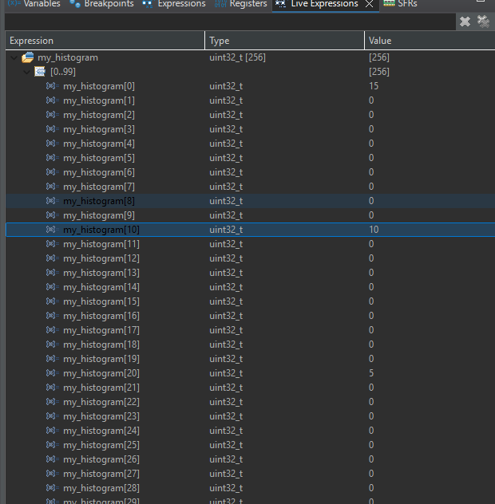
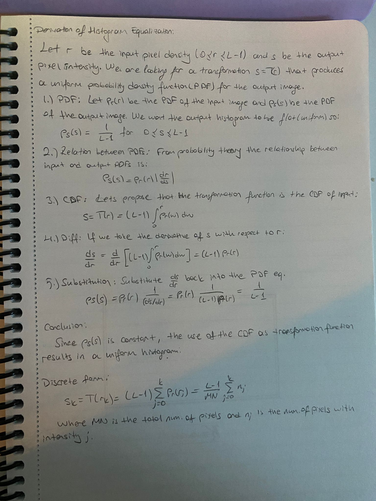
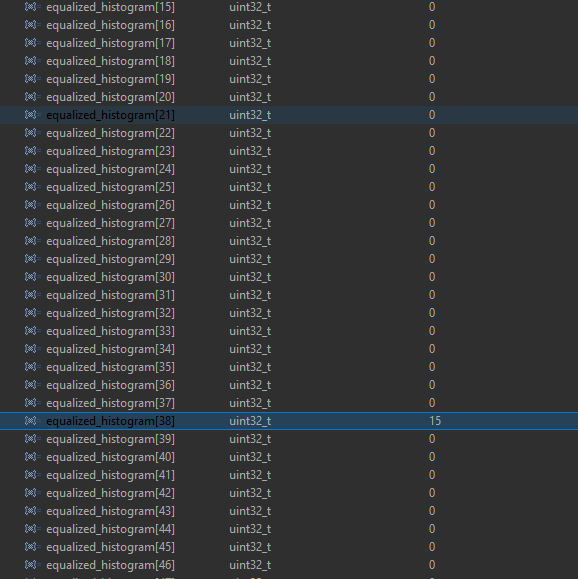
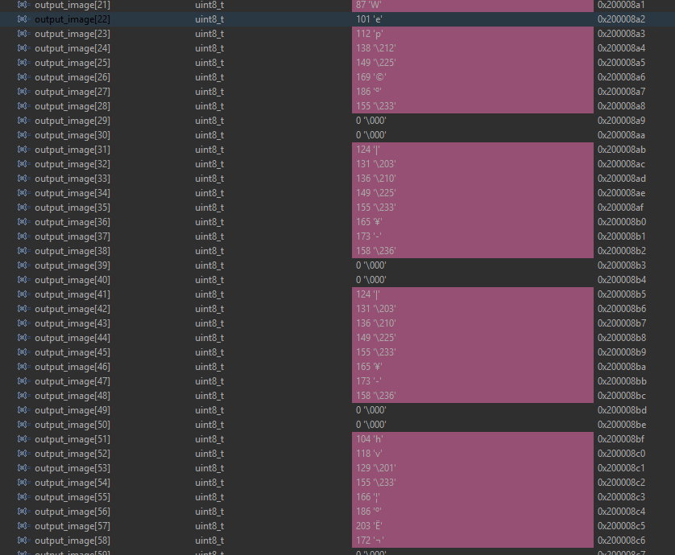
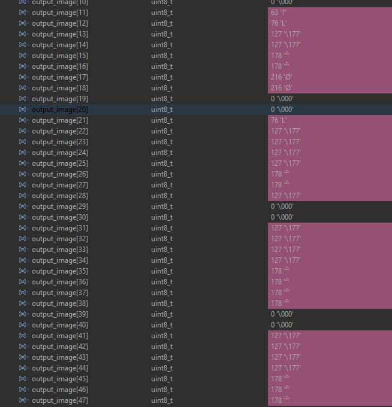

# EE 4065 - Embedded Digital Image Processing Project

This repository contains the solutions for the embedded image processing assignment using the STM32F446RET6 microcontroller. The project is written in C using STM32CubeIDE.

The main objective was to implement fundamental image processing algorithms directly on the microcontroller without using high-level libraries, manipulating raw pixel data stored in a header file.

## Hardware and Software

- **Board:** STM32F446RET6 (Nucleo-64)
- **IDE:** STM32CubeIDE
- **Language:** C
- **Input:** A raw grayscale image array stored in `image.h`.

## Project Details

The assignment consists of four main parts. Below is a summary of how each question was implemented and tested.

### Q1: Histogram Formation

The goal was to calculate the histogram of a given grayscale image to analyze pixel intensity distribution.

- I wrote a function that iterates through the image array.
- It counts the frequency of each pixel value (0-255) and stores it in a 256-element array called `my_histogram`.
- **Verification:** I verified the results by checking the array in the STM32 Live Expressions window, ensuring the counts matched the input data.
  

### Q2: Histogram Equalization

This step involved enhancing the contrast of the image using the histogram equalization method.

- First, I derived the mathematical formula based on the Cumulative Distribution Function (CDF) on paper.
  
- I implemented the algorithm in C by calculating the CDF from the histogram and normalizing the values to the 0-255 range.
- The original image array was updated with the new mapped values.
- **Result:** The new histogram covered a wider dynamic range compared to the original one, indicating improved contrast.

### Q3: 2D Convolution and Filtering

I implemented a generic convolution function that takes a 3x3 kernel matrix and applies it to the image.

- **Low Pass Filtering:** I used a kernel where all elements are 1 (normalized by dividing by 9). This successfully smoothed the image values, creating a blurring effect.
  
- **High Pass Filtering:** I used a Laplacian-style kernel with a positive center and negative surroundings. This filter highlighted the edges and transitions in the image while setting flat areas to near-zero values.
  

### Q4: Median Filtering

To remove noise while preserving edges, I implemented a median filter.

- Since this requires finding the median value in a local neighborhood, I wrote a helper function for **Bubble Sort**.
- For every pixel, the code collects the 3x3 neighborhood into a temporary array, sorts it, and picks the middle value (index 4).
- **Observation:** unlike the low pass filter, the median filter removed noise without blurring the sharp transitions between different pixel intensity blocks.
  

## How to Run

1.  Open the project in STM32CubeIDE.
2.  Connect the Nucleo board via USB.
3.  Build the project and start a Debug session.
4.  Add the following variables to the **Live Expressions** tab to observe the changes:
    - `my_histogram`
    - `equalized_histogram`
    - `output_image`
5.  Run the code.

---

**Student:** Mehmet Mert Yavaş
**Department:** Electrical and Electronics Engineering
